# TPS Entity Relationship Diagram

26 tables and one view. The diagram reflects `app/models/` exactly — the models are
the single source of truth (D1), and this document is maintained alongside them.

## The relationship that is most often misread

**`predictions` → `allocations` is one-to-zero-or-one.**

A prediction is *the engine's recommendation*. An allocation is *a human decision*.
They are separate tables joined by a `UNIQUE` constraint on
`allocations.prediction_id`, which is what makes the cardinality zero-or-one rather
than one-to-many.

Almost every prediction ends at zero: a run over 812 trainers produces hundreds of
ranked rows, and at most a handful become allocations. Those hundreds are not waste —
they are the record of what the system recommended and when, which is the evidence an
officer needs to explain a decision months later.

Collapsing the two into one table with a nullable `approved_at` would make deleting a
stale ranking the same operation as deleting a government decision. See ADR-0006.

```mermaid
erDiagram
    ROLES ||--o{ USERS : "grants"
    POLICE_RANKS ||--o{ USERS : "held by"
    POLICE_RANKS ||--o{ TRAINERS : "held by"
    USERS ||--o| TRAINERS : "is"
    USERS ||--o{ USERS : "created"
    USERS ||--o{ REFRESH_TOKENS : "owns"

    REGIONS ||--o{ STATIONS : "contains"
    DIRECTORATES ||--o{ TRAINERS : "posts"
    DIRECTORATES ||--o{ SPECIALIZATION_AREAS : "owns"
    STATIONS ||--o{ TRAINERS : "posts"
    STATIONS ||--o{ TRAINING_PROGRAMMES : "hosts"

    TRAINERS ||--o{ TRAINER_QUALIFICATIONS : "holds"
    TRAINERS ||--o{ TRAINER_SPECIALIZATIONS : "holds"
    TRAINERS ||--o{ TRAINER_UNAVAILABILITY : "declares"
    QUALIFICATION_LEVELS ||--o{ TRAINER_QUALIFICATIONS : "grades"
    INSTITUTIONS ||--o{ TRAINER_QUALIFICATIONS : "awarded"
    SPECIALIZATION_AREAS ||--o{ TRAINER_SPECIALIZATIONS : "categorises"
    PROFICIENCY_LEVELS ||--o{ TRAINER_SPECIALIZATIONS : "grades"

    TRAINING_CATEGORIES ||--o{ TRAINING_PROGRAMMES : "classifies"
    SPECIALIZATION_AREAS ||--o{ TRAINING_PROGRAMMES : "required by"
    QUALIFICATION_LEVELS ||--o{ TRAINING_PROGRAMMES : "minimum for"

    SCORING_POLICIES ||--o{ SCORING_POLICY_WEIGHTS : "weights"
    SCORING_POLICIES ||--o{ PREDICTION_RUNS : "governs"

    TRAINING_PROGRAMMES ||--o{ PREDICTION_RUNS : "ranked by"
    PREDICTION_RUNS ||--o{ PREDICTIONS : "ranks"
    PREDICTION_RUNS ||--o{ PREDICTION_EXCLUSIONS : "excludes"
    TRAINERS ||--o{ PREDICTIONS : "scored in"
    TRAINERS ||--o{ PREDICTION_EXCLUSIONS : "gated from"

    PREDICTIONS ||--o| ALLOCATIONS : "approved as"
    TRAINING_PROGRAMMES ||--o{ ALLOCATIONS : "staffed by"
    TRAINERS ||--o{ ALLOCATIONS : "assigned"
    USERS ||--o{ ALLOCATIONS : "approved"
    ALLOCATIONS ||--o| ALLOCATIONS : "superseded by"

    ALLOCATIONS ||--o| PERFORMANCE_EVALUATIONS : "rated by"
    TRAINERS ||--o{ PERFORMANCE_EVALUATIONS : "rated"
    TRAINING_PROGRAMMES ||--o{ PERFORMANCE_EVALUATIONS : "assessed in"
    USERS ||--o{ PERFORMANCE_EVALUATIONS : "evaluated"

    USERS ||--o{ AUDIT_LOGS : "acted"
    USERS ||--o{ NOTIFICATIONS : "receives"
    USERS ||--o{ TRAINER_UNAVAILABILITY : "recorded"
    USERS ||--o{ TRAINING_PROGRAMMES : "raised"
    USERS ||--o{ PREDICTION_RUNS : "generated"
    USERS ||--o{ SCORING_POLICIES : "authored"

    ROLES {
        bigint role_id PK
        varchar name UK "TRAINING_ADMINISTRATOR, ..."
        varchar display_name
        boolean is_system
    }
    POLICE_RANKS {
        bigint rank_id PK
        varchar code UK "ASP, SP, SSP"
        varchar full_name
        varchar management_level "STRATEGIC|SENIOR|MIDDLE|JUNIOR"
        smallint seniority_order UK "1 = most junior"
    }
    DIRECTORATES {
        bigint directorate_id PK
        varchar name UK
        boolean is_training_authority "true only for HRD"
    }
    REGIONS {
        bigint region_id PK
        varchar name UK
        varchar headquarters
    }
    STATIONS {
        bigint station_id PK
        varchar name
        bigint region_id FK
        varchar station_type "HEADQUARTERS|...|TRAINING_INSTITUTION"
    }
    SPECIALIZATION_AREAS {
        bigint specialization_area_id PK
        varchar name UK "BR-04 matches on this"
        bigint directorate_id FK "nullable"
        varchar discipline_group "subject grouping, ADR-0008"
    }
    TRAINING_CATEGORIES {
        bigint category_id PK
        varchar name UK "delivery mode, not subject"
    }
    INSTITUTIONS {
        bigint institution_id PK
        varchar name UK
        varchar institution_type "POLICE earns a scoring bonus"
    }
    QUALIFICATION_LEVELS {
        bigint level_id PK
        varchar code UK
        smallint rank_order UK
        numeric score_value "retunable, NFR-10"
    }
    PROFICIENCY_LEVELS {
        bigint level_id PK
        varchar code UK
        smallint rank_order UK
        numeric score_value "retunable, NFR-10"
    }

    USERS {
        bigint user_id PK
        citext username UK "case-insensitive"
        citext email UK
        varchar password_hash "Argon2id"
        bigint role_id FK
        bigint rank_id FK "nullable"
        varchar account_status "ACTIVE|SUSPENDED|DEACTIVATED"
        smallint failed_login_count "FR-01 lockout"
        timestamptz locked_until "nullable"
    }
    REFRESH_TOKENS {
        bigint token_id PK
        bigint user_id FK
        varchar token_hash "hash only, never the token"
        uuid family_id "rotation family"
        timestamptz revoked_at "nullable"
    }

    TRAINERS {
        bigint trainer_id PK
        bigint user_id FK "UNIQUE"
        varchar force_number UK
        bigint rank_id FK
        bigint station_id FK
        bigint directorate_id FK
        smallint years_experience
        varchar availability_status "BR-03 gate"
        varchar searchable_name "denormalised for trigram search"
        smallint profile_completeness "35% of confidence"
    }
    TRAINER_QUALIFICATIONS {
        bigint qualification_id PK
        bigint trainer_id FK "CASCADE"
        bigint level_id FK
        bigint institution_id FK
        smallint year_obtained
    }
    TRAINER_SPECIALIZATIONS {
        bigint specialization_id PK
        bigint trainer_id FK "CASCADE"
        bigint specialization_area_id FK
        bigint proficiency_level_id FK
    }
    TRAINER_UNAVAILABILITY {
        bigint unavailability_id PK
        bigint trainer_id FK "CASCADE"
        date start_date
        date end_date "EXCLUDE gist: no overlap per trainer"
        varchar category "LEAVE|COURT|DEPLOYMENT|STUDY|MEDICAL|OTHER"
    }

    TRAINING_PROGRAMMES {
        bigint programme_id PK
        varchar registry_number UK "TPS/REQ/2026/0132"
        varchar title
        bigint category_id FK
        bigint required_specialization_area_id FK "NULL until requirements set"
        smallint minimum_experience
        bigint minimum_qualification_level_id FK "nullable"
        varchar status "DRAFT|...|EVALUATED|CANCELLED"
        boolean requirements_changed_since_prediction
    }

    SCORING_POLICIES {
        bigint policy_id PK
        smallint version UK
        boolean is_active "partial unique: exactly one true"
        timestamptz effective_from
    }
    SCORING_POLICY_WEIGHTS {
        bigint weight_id PK
        bigint policy_id FK "CASCADE"
        varchar criterion_key "one of five"
        numeric weight "all five sum to 100"
        smallint sort_order
    }

    PREDICTION_RUNS {
        bigint run_id PK
        bigint programme_id FK
        bigint policy_id FK "nullable when simulated"
        jsonb weights_snapshot "frozen, never re-read"
        integer candidate_pool_size
        integer excluded_count
        integer ranked_count
        integer elapsed_ms "NFR-01"
        boolean is_superseded "never deleted"
    }
    PREDICTIONS {
        bigint prediction_id PK
        bigint run_id FK "CASCADE"
        bigint trainer_id FK "RESTRICT"
        numeric prediction_score
        numeric confidence_level
        varchar confidence_band "LOW|MODERATE|HIGH"
        integer rank_position "UNIQUE per run"
        jsonb breakdown "CriterionScore[]"
        text rationale
        text counterfactual "nullable, never invented"
    }
    PREDICTION_EXCLUSIONS {
        bigint exclusion_id PK
        bigint run_id FK "CASCADE"
        bigint trainer_id FK "RESTRICT"
        varchar reason "UNAVAILABLE|MISSING_SPECIALIZATION|..."
        varchar reason_detail
        varchar business_rule "BR-03|BR-04|FR-05"
    }

    ALLOCATIONS {
        bigint allocation_id PK
        varchar registry_number UK "TPS/ALL/2026/0417"
        bigint prediction_id FK "UNIQUE - D7"
        bigint programme_id FK
        bigint trainer_id FK
        bigint approved_by_user_id FK
        varchar status "PENDING_TRAINER|CONFIRMED|DECLINED|..."
        numeric frozen_score "the Decision Receipt"
        integer frozen_rank_position
        jsonb frozen_breakdown
        jsonb frozen_weights
        text frozen_rationale
        text decline_reason "required when DECLINED, FR-09"
    }
    PERFORMANCE_EVALUATIONS {
        bigint evaluation_id PK
        varchar registry_number UK "TPS/EVL/2026/0088"
        bigint allocation_id FK "UNIQUE"
        bigint trainer_id FK "denormalised, hot read path"
        bigint programme_id FK "denormalised"
        numeric score_awarded "1.0 - 5.0"
        date evaluation_date
    }

    AUDIT_LOGS {
        bigint log_id PK
        bigint actor_user_id FK "nullable for system actions"
        varchar actor_role "role at time of action"
        varchar action
        varchar entity_type
        bigint entity_id
        jsonb before_json
        jsonb after_json
        inet ip_address
    }
    NOTIFICATIONS {
        bigint notification_id PK
        bigint recipient_user_id FK "CASCADE"
        varchar type "ASSIGNMENT|APPROVAL|EVALUATION|SYSTEM|REMINDER"
        varchar status "UNREAD|READ"
        varchar delivery_status "PENDING|SENT|FAILED"
    }
```

## The view

`v_trainer_scoring_facts` is not shown above because it is derived, not an entity. It
aggregates per trainer:

| Column | Meaning |
|---|---|
| `evaluation_count` | Total evaluations recorded |
| `mean_score_awarded` | Mean rating across all evaluations |
| `last_evaluation_date` | Recency, feeding the confidence calculation |
| `evaluations_by_discipline_group` | JSONB map of discipline group → count |
| `mean_by_discipline_group` | JSONB map of discipline group → mean rating |
| `active_allocation_count` | Allocations currently occupying the trainer |
| `last_assignment_date` | Drives the utilisation report |
| `total_allocation_count` | Lifetime allocations |
| `qualification_count`, `specialization_count` | Profile depth |
| `profile_completeness` | Passed through from `trainers` |

It is a plain view, deliberately (ADR-0007).

## Cascade behaviour at a glance

| Parent → child | On delete | Why |
|---|---|---|
| `trainers` → qualifications, specialisations, unavailability | `CASCADE` | Meaningless without their trainer |
| `users` → `refresh_tokens` | `CASCADE` | A deleted user's sessions must not outlive them |
| `users` → `notifications` | `CASCADE` | No recipient, no meaning |
| `prediction_runs` → predictions, exclusions | `CASCADE` | A run and its output are one record |
| `training_programmes` → `prediction_runs` | `CASCADE` | Rankings belong to their programme |
| **Everything else** | `RESTRICT` | Allocations, evaluations, and audit entries form part of a decision record and outlive everything |

The rule: cascade only where the child is *part of* the parent. Never cascade
anything a government decision was based on.
